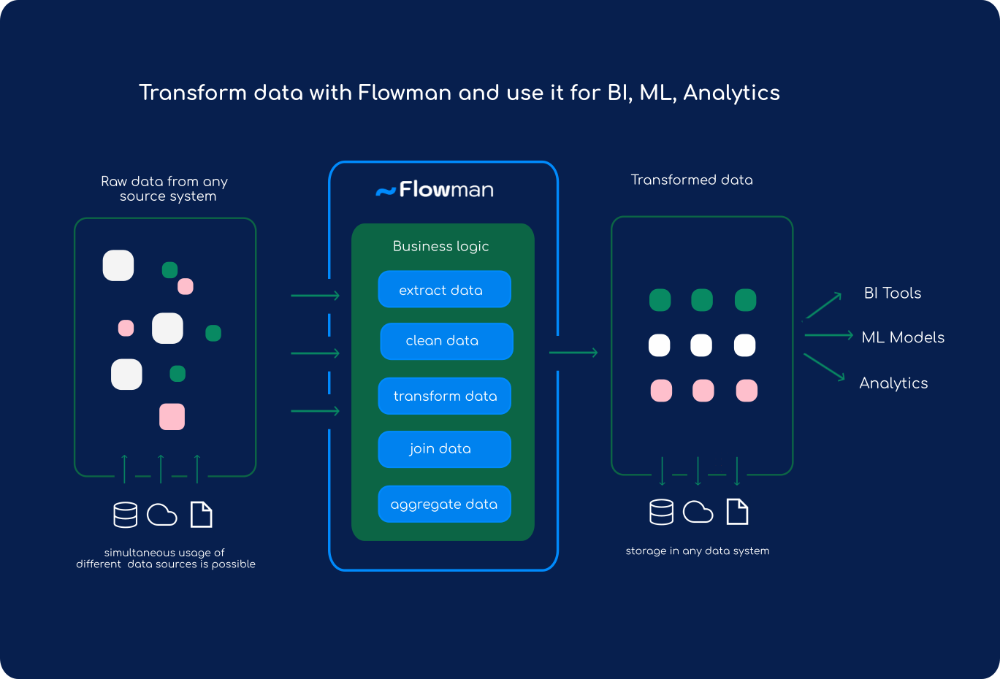

# [ Flowman](https://flowman.io)

[](https://opensource.org/licenses/Apache-2.0)
[](https://flowman.readthedocs.io/en/latest/)

Flowman is a Spark based *data build tool* that simplifies the act of writing data transformations as part of ETL
processes. The main idea is that users write purely declarative *specifications* which describe all details of the
data sources, sinks and data transformations instead of writing Spark jobs in Scala or Python. The main advantage of 
this approach is that many technical details of a correct and robust implementation are encapsulated and the user
can concentrate on the data transformations themselves.

In addition to writing and executing data transformations, Flowman can also be used for managing physical data models, 
i.e. Hive or JDBC tables. Flowman can create such tables from a specification with the correct schema. This helps to 
keep all aspects (like transformations and schema information) in a single place managed by a single program.

[](https://flowman.io)


### Noteable Features

* Semantics of a build tool like Maven - just for data instead for applications
* Declarative syntax in YAML files
* Data model management (Create, Migrate and Destroy Hive tables, JDBC tables or file based storage)
* Generation of meaningful documentation 
* Flexible expression language
* Jobs for managing build targets (like copying files or uploading data via sftp)
* Automatic data dependency management within the execution of individual jobs
* Meaningful logging output & rich set of execution metrics
* Powerful yet simple command line tools
* Extendable via Plugins


## Documentation

You can find the official homepage at [Flowman.io](https://flowman.io)
 and a comprehensive documentation at [Read the Docs](https://docs.flowman.io). 


# Installation

You can either grab an appropriate pre-build package at [GitHub](https://github.com/dimajix/flowman/releases) 

## Installing the Packed Distribution 

The packed distribution file is called `flowman-{version}-bin.tar.gz` and can be extracted at any 
location using
```shell
tar xvzf flowman-{version}-bin.tar.gz
```

## Apache Spark

Flowman does not bring its own Spark libraries, but relies on a correctly installed Spark distribution. You can 
download appropriate packages directly from [https://spark.apache.org](the Spark Homepage). 

## Hadoop Utils for Windows

If you are trying to run the application on Windows, you also need the *Hadoop Winutils*, which is a set of
DLLs required for the Hadoop libraries to be working. You can get a copy at https://github.com/kontext-tech/winutils .
Once you downloaded the appropriate version, you need to place the DLLs into a directory `$HADOOP_HOME/bin`, where
`HADOOP_HOME` refers to some location on your Windows PC. You also need to set the following environment variables:
* `HADOOP_HOME` should point to the parent directory of the `bin` directory
* `PATH` should also contain `$HADOOP_HOME/bin`


# Command Line Utils

The primary tool provided by Flowman is called `flowexec` and is located in the `bin` folder of the 
installation directory.

## General Usage

The `flowexec` tool has several subcommands for working with objects and projects. The general pattern 
looks as follows
```shell
flowexec [generic options] <cmd> <subcommand> [specific options and arguments]
```

For working with `flowexec`, either your current working directory needs to contain a Flowman
project with a file `project.yml` or you need to specify the path to a valid project via
```shell
flowexec -f /path/to/project/folder <cmd>
```
    
## Interactive Shell

With version 0.14.0, Flowman also introduced a new interactive shell for executing data flows. The shell can be
started via
```shell
flowshell -f <project>
```
    
Within the shell, you can interactively build targets and inspect intermediate mappings.


# Building

You can build your own version via Maven with
```shell
mvn clean install
```
Please also read [BUILDING.md](BUILDING.md) for detailed instructions, specifically on build profiles.


# Contributing

You want to contribute to Flowman? Welcome! Please read [CONTRIBUTING.md](CONTRIBUTING.md) to understand what you can 
do.
