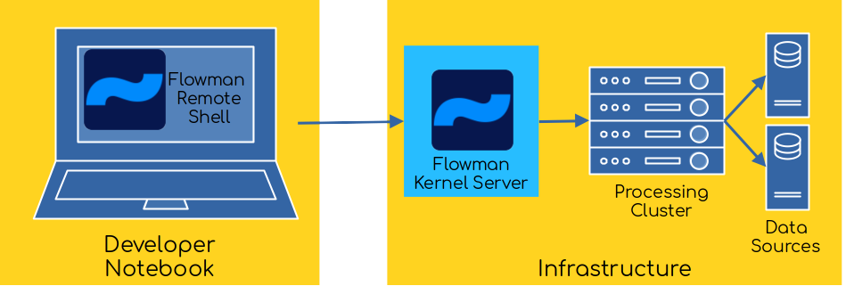

# Flowman Kernel Server (`flowman-kernel`)

*Available since Flowman version 1.0.0*

The Flowman Kernel Server (`flowman-kernel`) is the server part of a client/server architecture, such that the
server is started in an environment closely located to your data while the client is started on the developers local
machine. This allows the developer to efficiently work with large data sets on a simple developer machine without
the need to create complex firewall clearings to access a Spark cluster. Moreover, multiple developers can access
the same kernel at the same time, thus saving valuable compute resources.

## Requirements
The Flowman Kernel server is typically started on a server technically located near your big data infrastructure. It
will create a Spark session, and therefore needs connectivity to all data sources and whatever cluster you are using to 
run Spark applications (YARN, Kubernetes, ...).

The Flowman Kernel server will listen on a port, such that a [Flowman Remote Shell](../flowrshell/index.md) can
connect to the server, upload a project into a (temporary) workspace and execute arbitrary commands.

All clients connecting to the kernel will only need network access to the kernel. Flowman Kernel clients will never 
directly communicate with data sources, Spark clusters etc.

## Starting the Kernel Server

The server can be started via `flowman-kernel <options...>`, with the following `<options>` being supported: 
* `-h` displays help
* `-w <workspace_root>` specifies a workspace root directory where the kernel will store the projects uploaded
by the clients. Each client will upload its files into a separate workspace below this directory.
* `-p <port>` port to listen on, default ist 8088
* `--conf <key>=<value>` Sets a Flowman or Spark configuration variable
* `--spark-logging <level>` Sets the log level for Spark
* `--spark-master <master>` Explicitly sets the address of the Spark master
* `--spark-name <application_name>` Sets the Spark application name
* `-X` or `--verbose` Enables logging at more verbose level
* `-XX` or `--debug` Enables logging at debug level

You should at least always specify a `workspace_root` directory via the `-w` option, otherwise the current
working directory will be used (which is almost always not what you want).

Once the server is started, it will run in the foreground and wait for connections from Flowman clients (like the
[Flowman Remote Shell](../flowrshell/index.md)).

## Additional Configuration

The Flowman Kernel server loads the default namespace, which is defined via the 
[`conf/default-namespace.yml`](../../spec/namespace.md) file inside your Flowman installation directory. The namespace
contains important settings, like the list of plugins to load at startup.
