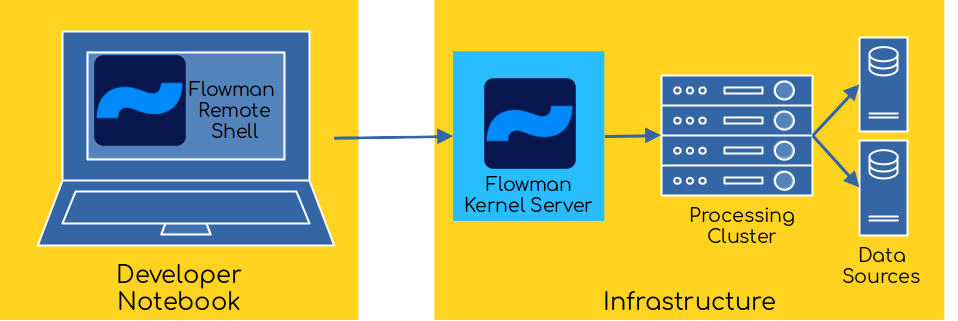

# Flowman Interactive Remote Shell (`flowrshell`)



*Available since Flowman version 1.0.0*

The Flowman Remote Shell is the client/server pendant of the [Flowman Shell](../flowshell/index.md) to be used
with a [Flowman Kernel Server](../flowman-kernel/index.md). It connects to a running Flowman Kernel Server,
uploads the current local working directory as a (temporary) workspace to the server and then will forward and
command to the server for execution. This means that the Flowman Remote Shell does not perform any local data
transformation, but delegates everything to the kernel. This in turn also means that the Flowman Remote Shell does
only need network access to the kernel and no other services like data sources, a YARN cluster etc.


### General Parameters
* `-h` displays help
* `-k <kernel_url>` specifies the URL of the Flowman Kernel server. Default is `grpc://localhost:8088`.
* `-f <project_directory>` specifies a different directory than the current for locating a Flowman project
* `-P <profile_name>` activates a profile as being defined in the Flowman project
* `-D <key>=<value>` Sets an environment variable
* `--conf <key>=<value>` Sets a Flowman or Spark configuration variable
* `--info` Dumps the active configuration to the console
* `--spark-logging <level>` Sets the log level for Spark
* `--spark-master <master>` Explicitly sets the address of the Spark master
* `--spark-name <application_name>` Sets the Spark application name
* `-X` or `--verbose` Enables logging at more verbose level
* `-XX` or `--debug` Enables logging at debug level

### Excluding Files (`.flowman-ignore`)
Before uploading the current local working directory to the kernel, the Flowman Remote Shell will look for a file
`.flowman-ignore`, which can contain a list of glob patterns of files and directories to ignore. All matching files and
directories will not be uploaded to the kernel. This allows you to exclude the local `.git` directory and similar files
which are not required by Flowman and would otherwise blow up the amount of data that needs to be transferred. A simple
example would look as follows
```ignore
# Ignore Docker
docker

# Ignore git directory 
.git

# Ignore IntelliJ directory
.idea

# Ignore all other dot-files
.*
```


### User Settings File
*Available since Flowman version 1.0.0*

By using the option `-D` and `--conf` you can manually override both Flowman environment and config variables. In
addition to these command line options, Flowman will also look for a file `.flowman-env.yml` in the current working
directory (which may not be the project directory!) for additional overrides. The file `.flowman-env.yml` looks as
follows:
```yaml
environment:
  # Override environment, for example set different directories
  - basedir=file:///tmp/weather
  - srcdir=$System.getenv('WEATHER_SRCDIR', 's3a://dimajix-training/data/weather')

config:
  # Override config, for example inject AWS Credentials
  - spark.hadoop.fs.s3a.access.key=$System.getenv('AWS_ACCESS_KEY_ID')
  - spark.hadoop.fs.s3a.secret.key=$System.getenv('AWS_SECRET_ACCESS_KEY')
```
The final values will be evaluated on the client side, not on the server side. This design makes it easier to override
some settings using system environment variables from the client side as opposed to the server side.
The recommendation is not to add this file to source control (like git). Instead, developers should maintain their
private copy of this file containing their specific configuration settings (like credentials, local directories etc.).


## Commands

Most commands within the Flowman Remote Shell mimic the commands of [`flowexec`](../flowexec/index.md). The main difference
to multiple invocations of `flowexec` is the fact that the project is loaded only once and some additional commands are 
provided.

The commands are organized in command groups
* `job`
* `kernel`
* `mapping`
* `model` or `relation`
* `namespace`
* `project`
* `session`
* `target`
* `test`

Some additional commands in `flowshell` which are not available via `flowexec` are
* `exit` or `quit`
