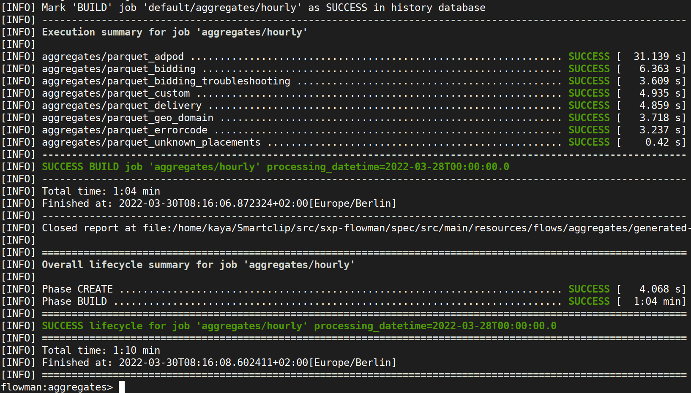

# Flowman CLI Tools

Flowman provides a small set of command line interface (CLI) executables for working with projects. These are used
to execute projects as batch jobs, to investigate intermediate results of mappings etc. Moreover, the Flowman History
Server will provide you a powerful Web UI for keeping track of past runs.

* [Flowman Executor (`flowexec`)](flowexec/index.md)
* [Flowman Shell (`flowshell`)](flowshell/index.md)
* [Flowman History Server](history-server.md)
 
In order to efficiently work with larger data sets, Flowman also supports a client/server model where a kernel server
is started within your Big Data environment and is accessed from the local development client via the Flowman Remote
Shell. This significantly simplifies working with huge amounts of data from a developer's client without the need
to provide a direct network connectivity to data sources, YARN clusters, etc. The client only needs to connect to
the Flowman Kernel server via a single port, and then all the work is performed by the server side.
* [Flowman Kernel Server](flowman-kernel/index.md)
* [Flowman Remote Shell (`flowrshell`)](flowrshell/index.md)
 
Finally, some tools help to improve your development experience with Flowman. The schema generator will create an
appropriate set of YAML schema files, which can be used in supported editors like Visual Studio Code, IntelliJ and
others.
* [Flowman Schema Generator](schema.md)
