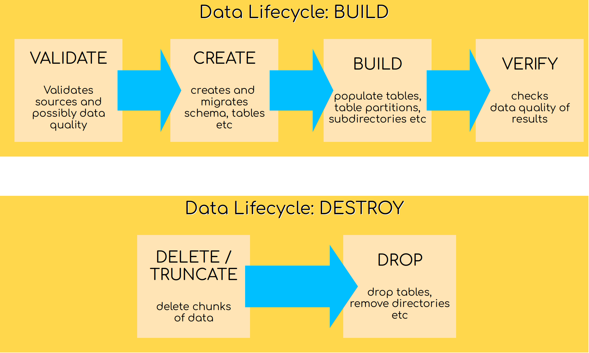

# Lifecycles and Phases

Flowman sees data as artifacts with a common lifecycle, from creation until deletion. The lifecycle itself consists of 
multiple different phases, each of them representing one stage of the whole lifecycle. 

## Execution Phases

The full lifecycle consists out of specific execution phases, as follows:

1. **VALIDATE**.
This first phase is used for validation and any error will stop the next steps. A validation step might for example
check preconditions on data sources which are a hard requirement.
   
2. **CREATE**.
This will create all relations (tables and directories) specified as targets. The tables will not contain any data,
they only provide an empty hull. If a target already exists, a migration will be started instead. This will migrate a 
relation (table or directory) to a new schema, if required. Note that this is not supported by all target types, and 
even if a target supports migration in general, it may not be possible due to unmigratable changes.

3. **BUILD**.
The *build* phase will actually create all records and fill them into the specified relations.

4. **VERIFY**.
The *verify* phase will perform simple checks (for example if a specific Hive partition exists), or may also include
some specific user defined tests that compare data. If verification fails, the build process stops.

5. **TRUNCATE**.
*Truncate* is the first of two phases responsible for cleanup. *Truncate* will only remove individual partitions from
tables (i.e. it will delete data), but it will keep tables alive.

6. **DESTROY**.
The final phase *destroy* is used to physically remove relations including their data. This will also remove table
definitions, views and directories. It performs the opposite operation than the *create* phase.

## Built In Lifecycles

Some execution phases can be performed in a meaningful way one after the other. Such a sequence of phases is
called *lifecycle*. Flowman has the following lifecycles built in:

### Build

The first lifecycle contains the three phases *VALIDATE*, *CREATE*, *BUILD* and *VERIFY*.

### Truncate

The second lifecycle contains only the single phase *TRUNCATE*

### Destroy

The last lifecycle contains only the single phase *DESTROY*

## Targets & Lifecycles

Each [target](../spec/target/index.md) supports a certain subset of execution phases. Not all targets support all 
phases. For example the widely used [`relation` target](../spec/target/relation.md) which is used for creating data 
sinks and for writing new data into them supports the phases `CREATE`, `BUILD`, `VERIFY`, `TRUNCATE` and `DESTROY`. On 
the other hand the [`measure` target](../spec/target/measure.md) which collects some data dependent metrics is only
executed during the `VERIFY` phase.

Of course when a specific target participates in multiple execution phases, it will perform different actions in each
of the phases. The documentation of each target will contain the details of the supported phases and what action is
performed in each of them.

## Jobs & Lifecycles

A [job](../spec/job/index.md) groups multiple [targets](../spec/target/index.md) to a logical bundle, which should be
built together. When executing a lifecycle for a job, Flowman will apply the following logic:

1. Interpolate any given parameter given on the command line, for example
   `flowexec job daily verify processing_date:start=2022-11-01 processing_date:end=2022-11-10`
  would cycle through 10 consecutive days and execute the job `daily` with the parameter `processing_date` set
  accordingly.
2. Iterate over all execution phases of the lifecycle (i.e. VALIDATE, CREATE, BUILD, VERIFY).
3. Perform dependency analysis of all targets within the job, which are active for the current execution phase
4. Identify all active targets in the current phase (possibly accordingly to the jobs `executions` section)
5. Check each target if it is *dirty* (i.e. it requires an execution) the current phase
6. Execute all active and dirty targets in the correct order

## Dirtiness

Before executing a target, Flowman checks if the target is actually *dirty*, i.e. if it is outdated. Typical examples
are a schema change in the `CREATE` phase, or a new data partition in the `BUILD` phase. Some details of this logic
can be influenced via the `buildPolicy` setting in the [`relation` target](../spec/target/relation.md)
or via the [Flowman config](../setup/config.md) `flowman.default.target.buildPolicy`. Possible values are
* `ALWAYS`: The target is always considered to be dirty.
* `IF_EMPTY`: The target is considered to be dirty, if the specified target partition does not exist (or is empty).
* `IF_TAINTED`: The target is considered to be dirty, only if it is tainted by a dirty dependency.
* `SMART`: The target is considered to be dirty, if the target partition is empty, or when the output mode is set to `APPEND` or when no partition is specified (full overwrite)
* `COMPAT`: The target is considered to be dirty, if the target is empty, or when the output mode is set to `APPEND`. This setting provides the same behaviour as Flowman before version 0.30.0.
The exact details always depend on the specific type of the [target](../spec/target/index.md).

Note that Flowman also cascades dirtiness during the execution. This means that if target B depends on target A, and
target A is dirty (because data is overwritten), then target B also becomes implicitly dirty via its dependency.
