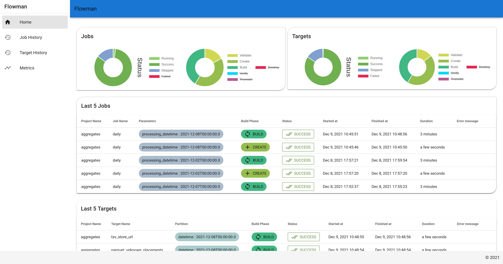

# Flowman History Server

The Flowman History Server provides both a REST interface and a small UI which gives you an overview of jobs and
targets executed in the past. In order to use the History Server, you need to configure a *history database* in
the [Flowman namespace](../spec/namespace.md).



## Configuration
The history database needs to be configured in the `default-namespace.yml` file and also (if used) in the
`history-server.yml` file. The first configuration will be used by [flowexec](../cli/flowexec.md) and 
[flowshell](../cli/flowshell.md) while the second file will be picked up by the Flowman History Server.

```yaml
# The following definition provides a "run history" stored in a database. If nothing else is specified, the database
# is stored locally as a Derby database. If you do not want to use the history, you can simply remove the whole
# 'history' block from this file.
history:
  kind: jdbc
  connection: flowman_state
  retries: 3
  timeout: 1000

# The following connection is used by the history database above.
connections:
  flowman_state:
    driver: $System.getenv('FLOWMAN_HISTORY_DRIVER', 'org.apache.derby.jdbc.EmbeddedDriver')
    url: $System.getenv('FLOWMAN_HISTORY_URL', $String.concat('jdbc:derby:', $System.getenv('FLOWMAN_HOME'), '/flowman-history;create=true'))
    username: $System.getenv('FLOWMAN_HISTORY_USER', '')
    password: $System.getenv('FLOWMAN_HISTORY_PASSWORD', '')

# This section enables plugins. You may want to remove plugins which are of no use for you.
plugins:
  - flowman-mariadb
  - flowman-mysql
  - flowman-mssqlserver
```
Note that this configuration falls back to a Derby database when no other database is provided via the system 
environment variables `FLOWMAN_HISTORY_*`. This setup is not recommended except for experimentation, as a Derby 
database can only be accessed by a single client at a time (which prevents running the History Server and 
flowexec/flowshell at the same time).

A more useful setup might look as follows:
```yaml
history:
  kind: jdbc
  retries: 3
  timeout: 1000
  connection:
    driver: "com.mysql.cj.jdbc.Driver"
    url: "jdbc:mysql://mysql-server.in.my.network/flowman_history"
    username: "flowman"
    password: "secret"

plugins:
  - flowman-mysql
```
Note that you also need to load the corresponding database plugin to provide the driver.


## Running

Once the History Server is configured, it can be started via `flowman-server`. This will start a web server which listens
on port 8080, so you should be able to access the UI via [http://localhost:8080](http://localhost:8080).
