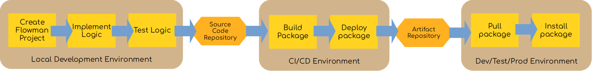

# Development & Deployment Workflow

This text will give you some guidance how a typical development workflow would look like. Unsurprisingly, the steps
should look very familiar since they represent the typical development workflow based on local development, CI/CD and
production deployment. The workflow starts from creating
a new Flowman project, describes how to run the project locally, build a self-contained redistributable package
and then deploy it to a remote repository manager like Nexus.



The whole workflow is implemented with [Apache Maven](https://maven.apache.org/), but you could of course also chose a 
different build tool. Maven was chosen simply because one can assume that this is present in a Big Data environment, so 
no additional installation on developer machines or CI/CD infrastructure is required.


## 1. Creating a new project from a Maven Archetype
First you need to create a new Flowman project. You can either copy/paste from one of the official Flowman examples,
or you can create a new project from a Maven archetype provided. This can be done as follows:
```shell
mvn archetype:generate \
  -DarchetypeGroupId=com.dimajix.flowman \
  -DarchetypeArtifactId=flowman-archetype-quickstart \
  -DgroupId=<your-group-id> \ 
  -DartifactId=<your-artifact-id>
```

This will create a new directory `<your-artifact-id>`, which looks as follows:
```
├── assembly.xml
├── conf
│   ├── default-namespace.yml
│   └── flowman-env.sh
├── deps.txt
├── flow
│   ├── config
│   │   ├── aws.yml
│   │   ├── config.yml
│   │   ├── connections.yml
│   │   └── environment.yml
│   ├── documentation.yml
│   ├── job
│   │   └── main.yml
│   ├── mapping
│   │   └── measurements.yml
│   ├── model
│   │   ├── measurements-raw.yml
│   │   └── measurements.yml
│   ├── project.yml
│   ├── schema
│   │   └── measurements.json
│   ├── target
│   │   ├── documentation.yml
│   │   └── measurements.yml
│   └── test
│       └── test-measurements.yml
├── pom.xml
└── README.md
```
The project provides a skeleton structure with the following entities:
* A couple of relations (one source `measurements_raw` and two sinks `measurements` and `measurements_raw`)
* A couple of mapping to extract measurement information from `measurements_raw`
* Two targets for writing the extracted measurements as files and to a JDBC database
* One `main` job containing both targets
* A small test suite in the `flow/test` directory
* Some configuration options in the `flow/config` directory


## 2. Implementing your logic
With this small project, you can now start implementing your business logic. The project contains some predefined
relations, mappings, jobs and targets. These will not be of any direct use by you, but they give you some guidance
how to implement your logic with the Flowman framework.

You should focus on the following entities:
* relations, which define the data sources and sinks
* targets, which define the execution targets to be executed
* jobs, which bundle multiple related targets into a single executable job
  Moreover, you might want to adjust environment and connection settings in the `config` subdirectory.

Once you have implemented your initial logic, you better remove all parts from the original skeleton, specifically you
should remove (or replace) all mappings, relations, jobs and targets.


## 3. Testing your logic
Once you have implemented your business logic and tidied up the original skeleton relations, mappings, etc, you should
perform a first test on your local machine. In order to do so, you can either use a local installation of Flowman
(a good approach on Linux machines) or run Flowman within a Docker container (the simplest method for all environments, 
like Linux, Windows and Mac OS).

### Chose how to set up Flowman locally

#### 1. Running with installed Flowman
In order to run tests with a local Flowman installation, you first need to setup Flowman on your local machine
[as described in the documentation](setup/installation.md).

#### 2. Running wih Docker
A much simpler option than setting up a local Flowman development installation is to use the pre-built Docker
images. This approach is recommended especially for Windows users, but is also very simple for Linux and Mac users.

```shell
docker run --rm -ti --mount type=bind,source=<your-project-dir>,target=/opt/flowman/project dimajix/flowman:0.27.0-oss-spark3.3-hadoop3.3 bash
```

### Using Flowman Shell
Once you have decided on the approach (local installation or Docker) for running Flowman, you can easily start the
Flowman shell via
```shell
bin/flowshell -f <your-project-dir>
```
Please read more about using the Flowman Shell in the [corresponding documentation](cli/flowshell/index.md).

Whenever you change something in your project, you can easily reload the project in the shell via
```shell
project reload
```


## 4. Building a complete package

Once you are happy with your results, you can build a self-contained redistributable package with Maven via
```shell
mvn clean install
```
This will run all tests and create package `<your-artifactId>-<version>-dist-bin.tar.gz` contained inside the `target` 
directory.  The package will contain both Flowman and your project. It will not include Spark or Hadoop, these still 
need to be provided by your environment.


## 5. Pushing to remote Repository

This step possibly should be performed via a CI/CD pipeline (for example Jenkins). Of course the details heavily depend
on your infrastructure, but basically the following command will do the job:
```shell
mvn deploy
```
This will deploy the packaged self-contained redistributable archive to a remote repository manager like Nexus. Of
course, you will need to configure appropriate credentials in your Maven `settings.xml` (this is a user-specific
settings file, and not part of the project).


## 6. Deploying to Production

This is the most difficult part and completely depends on your build and deployment infrastructure and on your target
environment (Kubernetes, Cloudera, EMR, ...). But generally, the following steps need to be performed:

### 1. Fetch redistributable package from remote repository
You can use Maven again to retrieve the correct package via
```shell
mvn dependency:get -Dartifact=<your-groupId>:<your-artifactId>:<version> -Ddest=<your-dest-directory>
```

### 2. Unpack redistributable package at appropriate location
You can easily unpack the package, which will provide a complete Flowman installation (minus Spark and Hadoop):
```shell
tar xvzf <your-artifactId>-<version>-dist-bin.tar.gz
```

### 3. Run on your infrastructure

Within the installation directory, you can easily run Flowman via
```shell
bin/flowexec -f flow test run
```
Or you can of course also start the Flowman Shell via
```shell
bin/flowshell -f flow
```
